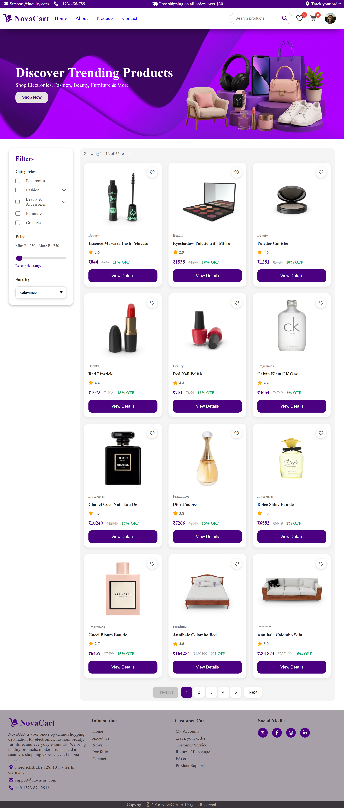
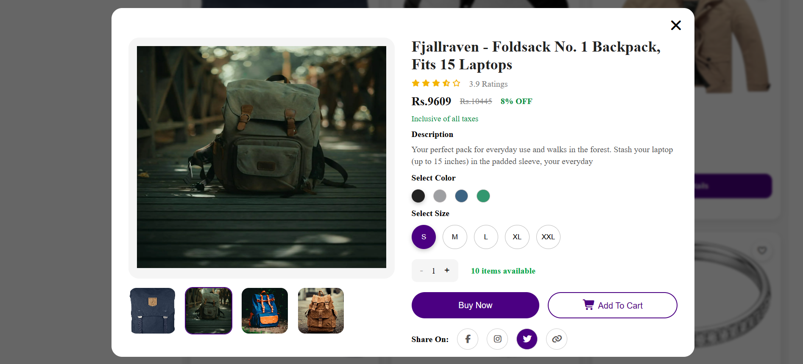
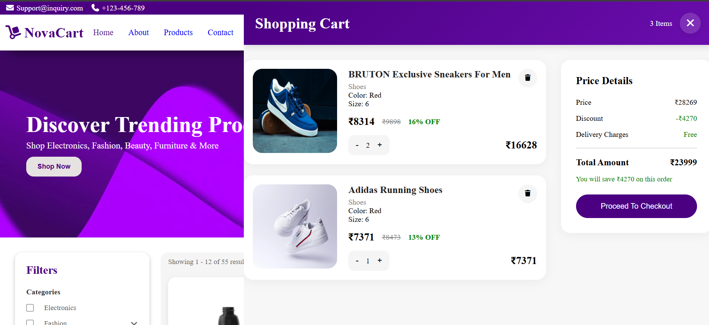
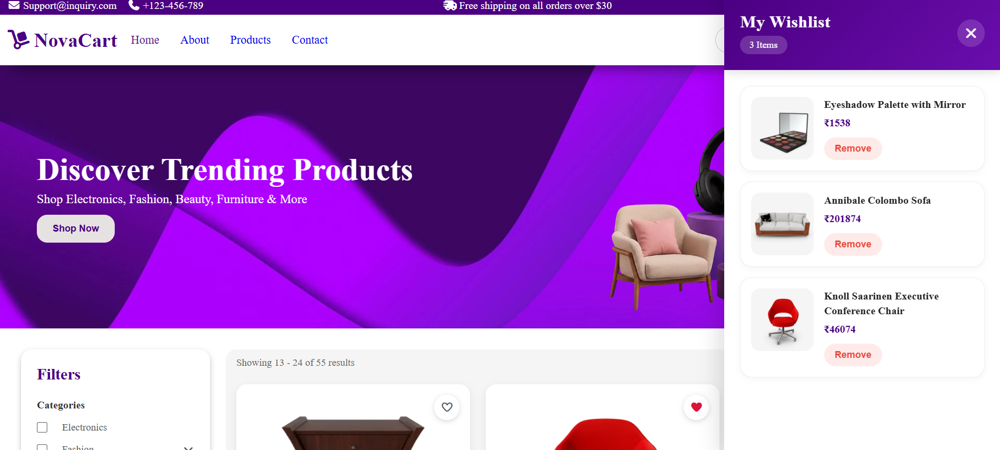
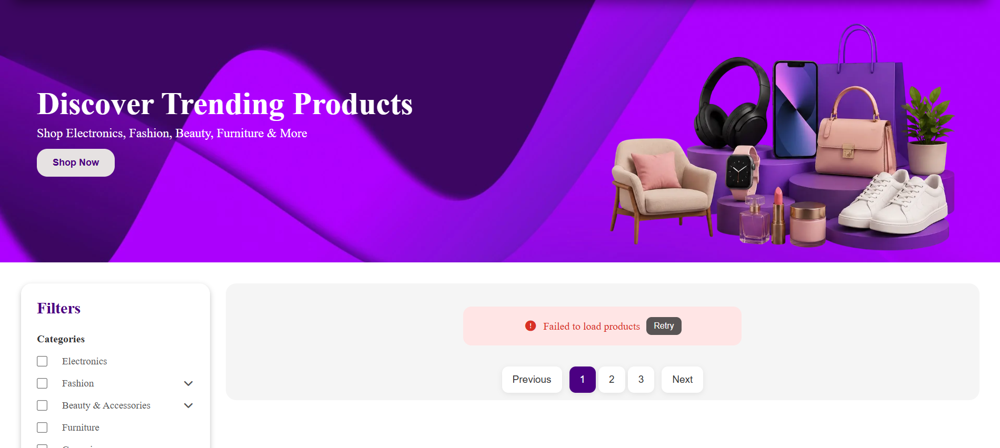
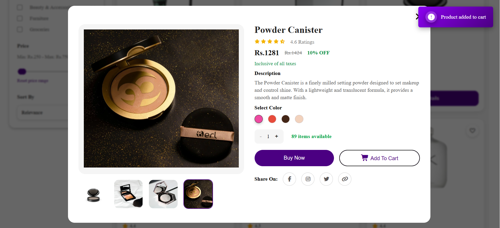

# NovaCart | Online Shopping Store
NovaCart is a fully responsive, dynamic e-commerce website built using HTML, CSS, JavaScript, and multiple APIs. The project includes dynamic product listing, search functionality, category filtering, price range filtering, product sorting, product modal preview, cart functionality, wishlist management, pagination, local storage support, and responsive UI design. 

## Features
### Product Management
- Fetch products from multiple APIs
- Dynamic product rendering
- Product pagination system
- Product image gallery with thumbnails
- Multiple product categories

### Search, Filtering & Sorting
- Real-time search functionality
- Debounced search optimization
- Category-based filtering
- Price range filtering
- Product sorting:
  - Price Low to High
  - Price High to Low
  - Ratings
  - Discount
  - Newest Products

### Wishlist System
- Add/remove products to wishlist
- Wishlist stored in Local Storage
- Dynamic wishlist count update
- Restore wishlist after page refresh

### Shopping Cart
- Add to cart functionality
- Product quantity management
- Cart summary calculations
- Delivery charge handling
- Discount calculation
- Persistent cart using Local Storage

### Product Modal
- Detailed product preview modal
- Product image switching
- Product stock handling
- Product variations:
  - Colors
  - Sizes
- Dynamic rating stars

### Performance Features
- Loading skeleton animation
- Efficient pagination rendering
- Notification messages
- Error handling UI
- Retry button for failed API requests

### Responsive Design
- Mobile responsive navigation
- Responsive product grid
- Responsive filter sidebar
- Optimized UI for all screen sizes

## Technologies Used
- HTML5
- CSS3 
- JavaScript (ES6+)
- APIs (DummyJSON API, FakeStore API & Custom Local JSON data)
- Font Awesome for icons
- Local storage 

## Demo GIF


## Preview
<table align="center">
<tr>
<td align="center">
<h4>Homepage</h4>
<a href="assets/images/screenshots/Homepage.png">
    
</a>
</td>
<td align="center">
<h4>Product Modal</h4>
<a href="assets/images/screenshots/ProductModal.png">
    
</a>
</td>
</tr>

<tr>
<td align="center">
<h4>Cart Page</h4>
<a href="assets/images/screenshots/ShoppingCartPage.png">
    
</a>
</td>
<td align="center">
<h4>Wishlist Page</h4>
<a href="assets/images/screenshots/WishlistPage.png">
    
</a>
</td>
</tr>

<tr>
<td align="center">
<h4>Network Error Message</h4>
<a href="assets/images/screenshots/NetworkErrorMsg.png">
    
</a>
</td>
<td align="center">
<h4>Notification Message</h4>
<a href="assets/images/screenshots/NotificationMsg.png">
    
</a>
</td>
</tr>
</table>

## Deployment
* **GitHub Pages:**  [View Demo](https://athira-rkrishnan.github.io/javascript-ecommerce-store/)
* **Netlify:**  [View Demo](https://novacart-ecommerce-store-js.netlify.app/)
* **Vercel:**  [View Demo](https://javascript-novacart-ecommerce-store.vercel.app/)

## Responsive Design Screenshots
* **Responsive at 480px:**   [View](assets/images/screenshots/Responsive-480px.png)
* **Responsive at 768px:**   [View](assets/images/screenshots/Responsive-768px.png)
* **Responsive at 1024px:**   [View](assets/images/screenshots/Responsive-1024px.png)


## How It Works
- Fetches product data from multiple APIs and local JSON files.
- Displays products with pagination, filtering, and sorting.
- User can search, filter by categories, price, and sort products.
- Click "View Details" to see a modal with product options, images, ratings, and add to cart.
- Manage wishlist and cart with persistent storage.
- Dynamic updates for wishlist and cart counters.

## Setup & Usage
1. Clone or download the repository.
```
 https://github.com/athira-rkrishnan/javascript-ecommerce-store.git
```
2. Navigate to the project folder:
```
cd javascript-ecommerce-store
```
3. Run the project using a local development server:

Using VS Code Live Server:
```bash
Right Click → Open with Live Server
```
Or using npm:
```bash
npx serve .
```
4. Open the local URL shown in the browser (for example: `http://localhost:5500`).
> **Note:** Opening `index.html` directly in the browser may prevent products from loading because browsers block local API/JSON requests due to CORS security restrictions.

5. Explore the various features by browsing, filtering, searching, and managing cart & wishlist.

## Customization
- Update product data or add new categories in `shoes.json` or the `productImages` object.
- Customize styles in `style.css`.
- Extend functionalities or integrate with real backend APIs.

## Challenges Faced & Solutions

| #  | Challenge Faced                                                        | Solution Implemented                                                                                     |
|----|------------------------------------------------------------------------|----------------------------------------------------------------------------------------------------------|
| 1. | Managing products from multiple APIs with different data structures     | Used `Promise.all()` to fetch APIs simultaneously and normalized product data into a unified structure using `.map()`. |
| 2. | Creating Unique Product IDs across multiple APIs                        | Generated custom unique IDs using `${category}-${product.id}` to avoid conflicts.                     |
| 3. | Search functionality triggering too frequently while typing             | Implemented debouncing with `setTimeout()` to optimize performance and reduce unnecessary function calls.     |
| 4. | Handling API failures and broken network requests                         | Added error handling UI with retry functionality using `try...catch`.                                |
| 5. | Handling missing product data                                             | Implemented fallback values for missing data like stock, images, and discount percentage.            |
| 6. | Building dynamic product variations such as sizes and colors for different categories | Created a reusable `generateProductVariations()` function to dynamically generate variations based on category type. |
| 7. | Pagination breaking after filtering or searching products                | Maintained a separate `filteredProductsData` array and dynamically updated pagination based on filtered results.             |
| 8. | Synchronizing search, filters, sorting, and pagination together          | Used centralized state management with `allProductsData` and `filteredProductsData` arrays to keep operations synchronized. |

## Future Improvements
- User Authentication
- Payment Gateway Integration
- Backend Integration
- Order Tracking
- Product Reviews
- Dark Mode
- Admin Dashboard
- Backend Database Integration

## What I Learned
- API Integration
- Advanced DOM Manipulation
- State Management using LocalStorage
- Responsive UI Design
- Event Delegation
- Pagination Logic
- Debouncing
- Dynamic Rendering
- Error Handling
- E-commerce UI/UX Development

## License
This project is created for learning and portfolio purposes.

Feel free to explore, fork, and learn from the code for personal and educational use.

⭐ If you found this project useful, feel free to star the repository and explore the codebase.
